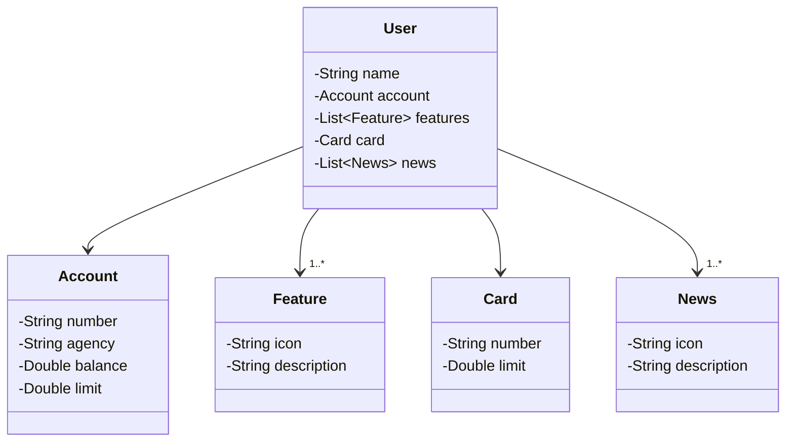
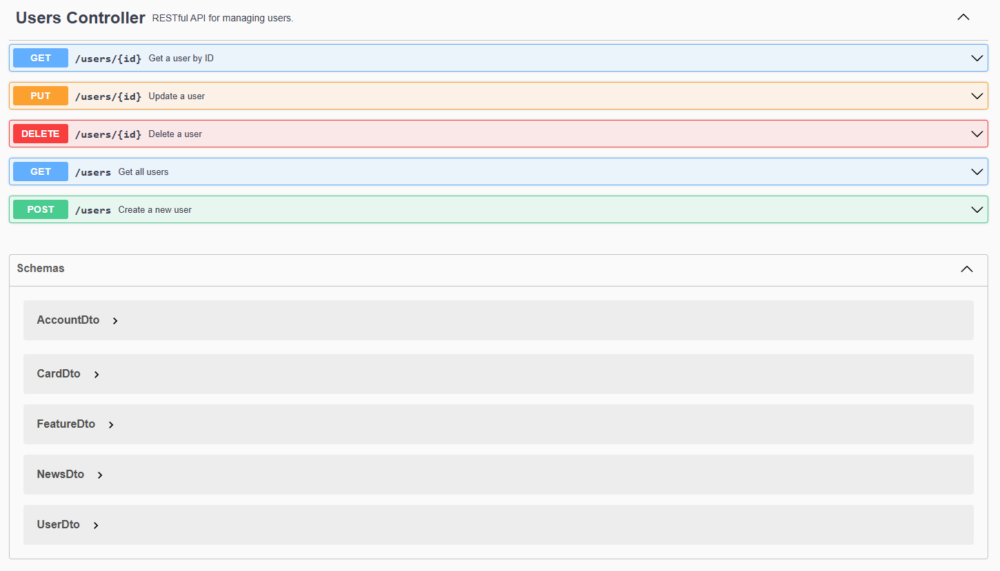
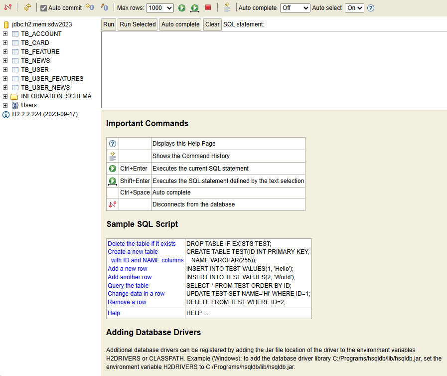

# Projeto Final DIO 2024

- #### Esta API demonstra o funcionamento de uma Web API de um cliente de banco e sua interação com Swagger

## Principais Tecnologias
 
- **Java 17**
- **Spring Boot 3**
- **Spring Data JPA**
- **OpenAPI (Swagger)**
- **Railway**

## [Link do Figma](https://www.figma.com/file/0ZsjwjsYlYd3timxqMWlbj/SANTANDER---Projeto-Web%2FMobile?type=design&node-id=1421%3A432&mode=design&t=6dPQuerScEQH0zAn-1)

O Figma foi utilizado para a abstração do domínio desta API, sendo útil na análise e projeto da solução.

## Diagrama de Classes (Domínio da API)

### Documentação da API: Swagger

### Banco de Dados em memória H2 Database

